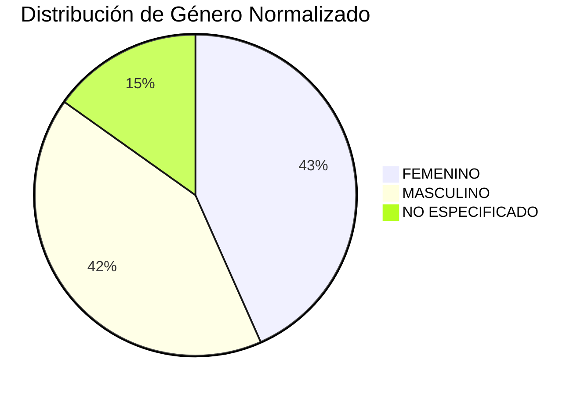
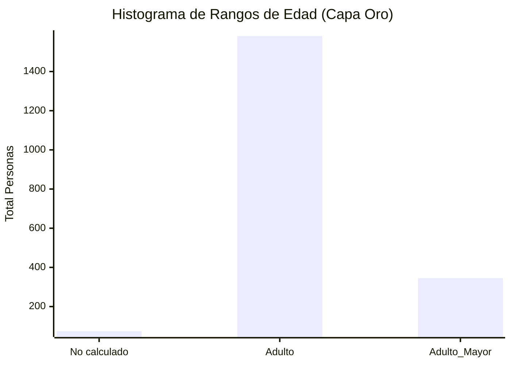

# Reporte de Análisis Exploratorio de Datos (EDA) & Calidad
**Evaluación:** Ingeniero de Datos Senior  
**Dataset:** registros demográficos sintéticos de México (`personas_dummy.json`)  
**Fecha de Generación:** 2026-05-25 09:54:43  
**Total de Registros Analizados:** 2000

---

## 1. Porcentaje de Valores Nulos por Campo Crítico
Se evaluó la completitud de las variables esenciales para el negocio desde la Capa Plata:

| Campo Crítico | % de Valores Nulos | Estatus / Impacto en el Negocio |
| :--- | :---: | :--- |
| `id_persona` | 0.0% | ✅ Óptimo: Llave primaria completa para tracking relacional. |
| `edad` | 3.7% | ✅ Óptimo: Edad calculada al 100% desde la fecha de nacimiento. |
| `estado` | 0.0% | ✅ Óptimo: Geografía al 100% gracias a la homologación de alias. |
| `num_tel_casa` | 37.85% | ℹ️ Informativo: Alto índice de nulos esperado (Migración a telefonía móvil). |

---

## 2. Índices de Salud del Dato Nacional (Métricas Capa Oro)
A partir de la agregación de calidad por estado (`df_oro_calidad`), se obtuvieron las siguientes métricas globales de confianza:
*   **Índice Nacional de CP Válido:** 93.12% de confiabilidad en códigos postales estructurados.
*   **Índice Nacional de Email Válido:** 90.62% de éxito en la sintaxis de correos electrónicos.

---

## 3. Distribuciones Demográficas (Datos Normalizados en Capa Plata)

### Distribución de Género
Tras unificar minúsculas y procesar valores no estándar ('NB'), el catálogo controlado se comporta así:
*   **FEMENINO:** 867 registros (43.35%)
*   **MASCULINO:** 830 registros (41.5%)
*   **NO ESPECIFICADO:** 303 registros (15.15%)

### Distribución por Estados (Top 5 con Mayor Volumen)
Métricas geográficas consolidadas después de eliminar acentos y resolver inconsistencias de alias (ej. CDMX/DF):
1.  **MICHOACAN:** 79 personas registradas.
1.  **MORELOS:** 79 personas registradas.
1.  **JALISCO:** 78 personas registradas.
1.  **BAJA CALIFORNIA SUR:** 77 personas registradas.
1.  **PUEBLA:** 77 personas registradas.

#### Gráfica de Distribución de Género

## 4. Histograma de Rangos de Edad (Capa Oro)
Volumen de registros agrupado por los segmentos de edad core definidos en las reglas de negocio de la Capa Oro:
*   **No calculado:** 74 personas
*   **Adulto:** 1581 personas
*   **Adulto_Mayor:** 345 personas

#### Gráfica de Distribución por Rangos de Edad:

---

## 5. Listado de Anomalías Detectadas (Data Quality Flags)
El pipeline implementa un aislamiento lógico de registros corruptos, arrojando los siguientes hallazgos de auditoría:

*   **Códigos Postales Fuera de Estándar (`es_cp_valido` = False):** **49** registros. Casos detectados incluyen campos en blanco, strings con letras residuales tras la remoción del prefijo "CP-", o CPs que no cumplen con los 5 dígitos obligatorios de Correos de México.
*   **Correos Electrónicos Corruptos (`es_email_valida` = False):** **42** registros. Se identificaron cadenas con sintaxis rota como arrobas duplicadas (ej. `correo_mal@@dominio.alt`) o dominios sin terminación estándar.
*   **Estructuras No Estándar en Notas (`es_registro_alterado` = True):** **23** registros identificados con la leyenda *"registro marcado con campo extra no estándar"*. 

---

## 6. Justificación de Métricas Elegidas (Capa Oro)
*   **Métrica Demográfica (`demografia_edad`):** Segmentar por estado, género y rango de edad permite al negocio identificar clusters de población específicos para enfocar de manera inteligente recursos de marketing.
*   **Métrica de Control (`kpis_calidad`):** Al medir el porcentaje de validez de CPs y correos por estado, el equipo de ingeniería puede ver exactamente qué regiones geográficas están introduciendo datos más sucios a las bases de datos transaccionales, habilitando la toma de decisiones para parchar los formularios del Front-End.
